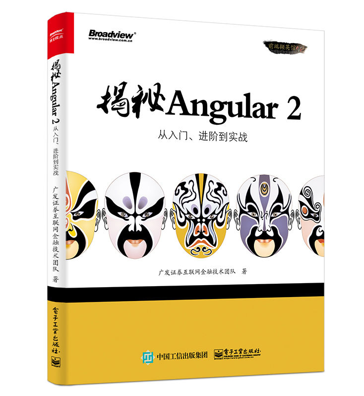

# Angular 2 调查问卷示例项目

### 这是由广发证券互联网金融技术团队出品的原创书籍《揭秘 Angular 2》的第三部分项目实战的源代码。



这个示例项目包含以下特点：

 * 遵循官方最佳实践的目录布局
 * 代码难易程度适中，方便学习
 * 功能丰富的脚手架，易于扩展使用
 * 简洁化的后端服务，聚焦前端框架学习
 

## 如何上手

调查问卷项目包括前端 frontend 目录以及后端 backend 目录。我们可以先运行后端服务，方便前端的注册与登录用户以及提供问卷相关的服务。安装过 Node.js 之后，在终端运行以下命令：

```bash
cd backend
npm install
node app.js
```

接下来，将终端目录定位 frontend 之中，再运行以下命令：

```bash
npm install
```

接着使用 `npm start` 即可运行整个项目代码。
